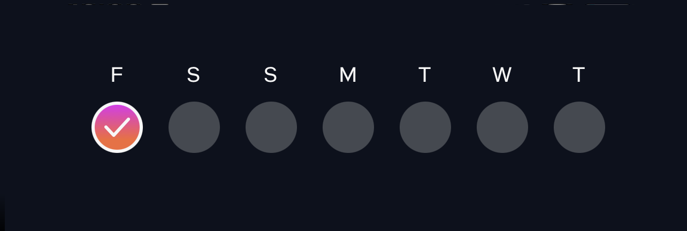
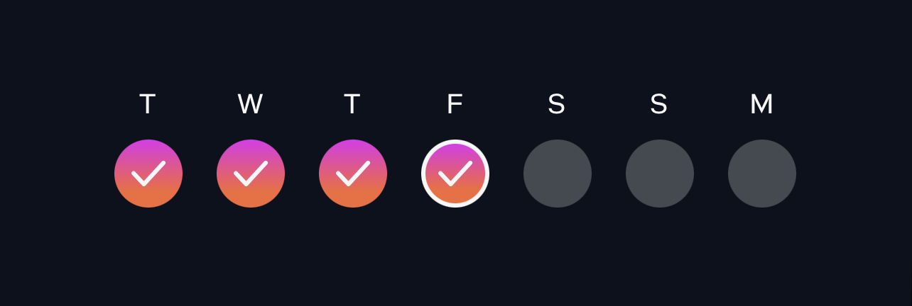
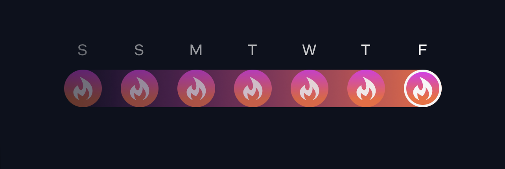
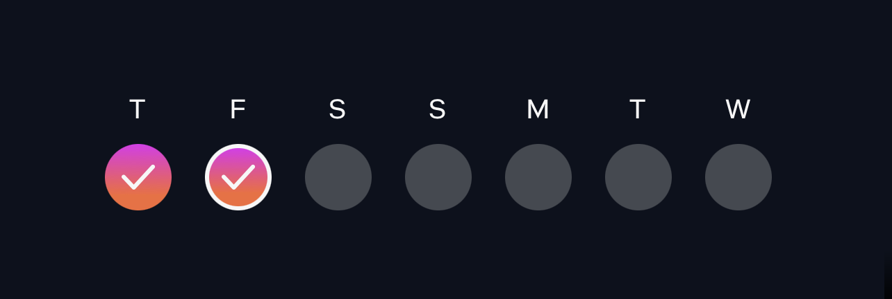
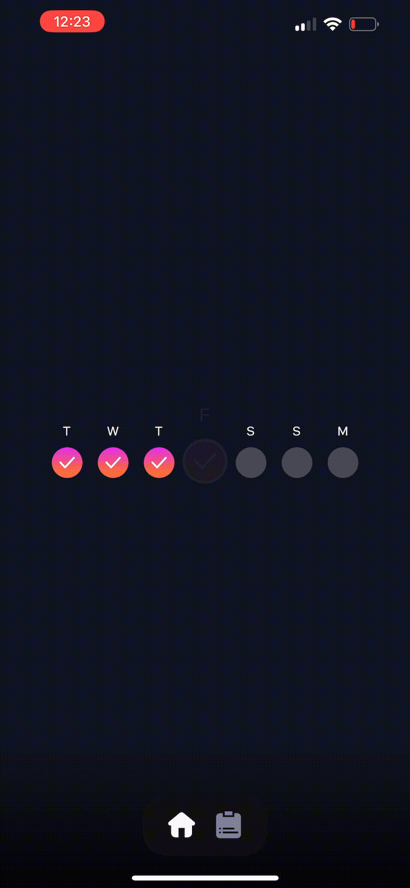
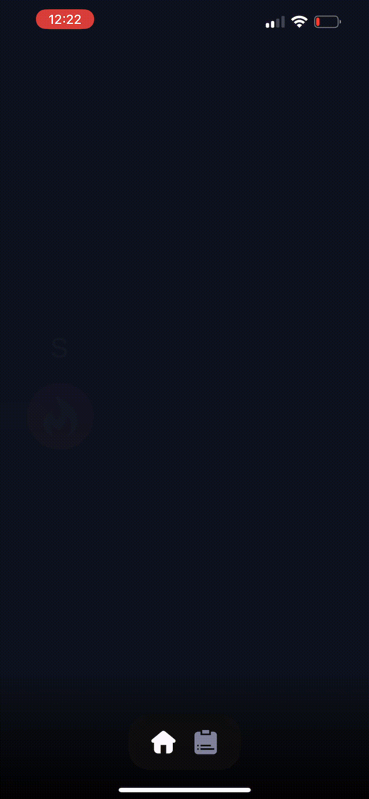

# Bloom React Native Development Challenge

## Overview
Design and implement a React Native component to display a 'Workout Streak'. The streak is a continuous string of days where a user successfully completes a workout.

> ℹ️ Please commit often so that we know how you think


**Acceptance Criteria:**

1. **Streak Component:** Create a component to depict a Workout Streak over a span of 7 days.
2. **Streak Days:** Streak days should always begin from the first day of the the streak, and proceed in a rolling seven-day period (see example scenarios below for the 9day streak).
3. **Current Day Highlight:** Current day should have a border.
4. **'Perfect Week' Display:** On the completion of seven sequential workouts, introduce a 'Perfect Week' status.
    - Show the 'Perfect Week' status on each seventh consecutive day of the streak (i.e., Day 7, 14, 21, 28, etc.).
5. **'Flame' Icon:** When the 'Perfect Week' status is on display, incorporate a 'Flame' icon on the Day Component for each day of that week.


## Design Resource
Please refer to the Figma file for design reference:
[Streak Component Figma](https://www.figma.com/file/WQEJ6Bl9XJ2MTbdXcLA62n/Streak-Component?node-id=1%3A142&mode=dev)

## Example Scenarios
Here are some instances of the Streak component with varying streak lengths as provided by the API.

### Single Day Streak
```
{
  "streak": ["2023-07-21T12:07:47+01:00"]
}
```


### Four-Day Streak
```
{
  "streak": [
    "2023-07-21T12:07:47+01:00",
    "2023-07-22T12:07:47+01:00",
    "2023-07-23T12:07:47+01:00",
    "2023-07-24T12:07:47+01:00"
  ]
}
```


### Perfect Week (7-Day Streak)
```
{
  "streak": [
    "2023-07-21T12:07:47+01:00",
    "2023-07-22T12:07:47+01:00",
    "2023-07-23T12:07:47+01:00",
    "2023-07-24T12:07:47+01:00",
    "2023-07-25T12:07:47+01:00",
    "2023-07-26T12:07:47+01:00",
    "2023-07-27T12:07:47+01:00"
  ]
}
```


### Nine-Day Streak
```
{
  "streak": [
    "2023-07-21T12:07:47+01:00",
    "2023-07-22T12:07:47+01:00",
    "2023-07-23T12:07:47+01:00",
    "2023-07-24T12:07:47+01:00",
    "2023-07-25T12:07:47+01:00",
    "2023-07-26T12:07:47+01:00",
    "2023-07-27T12:07:47+01:00",
    "2023-07-28T12:07:47+01:00",
    "2023-07-29T12:07:47+01:00"
  ]
}
```


## Project Setup
- Clone the repository.
- Execute `yarn install` to install the dependencies.
- Launch the project with `yarn start`.

# ⭐️ Bonus: Animation Implementation

For bonus points, consider incorporating the following animations:

(Note: You'll need to install necessary dependencies. We recommend using [Moti](https://moti.fyi/) and [React Native Reanimated](https://docs.swmansion.com/react-native-reanimated/))

- Animate the Streak Day Component on the current day.
  

- On achieving a 'Perfect Week,' animate all Day Components along with the gradient.
  


---
Copyright [Bloom](https://usebloom.com) 2023 - all rights reserved
If you find this test by yourself, you can apply by sending an email to ovi at usebloom dot com 
